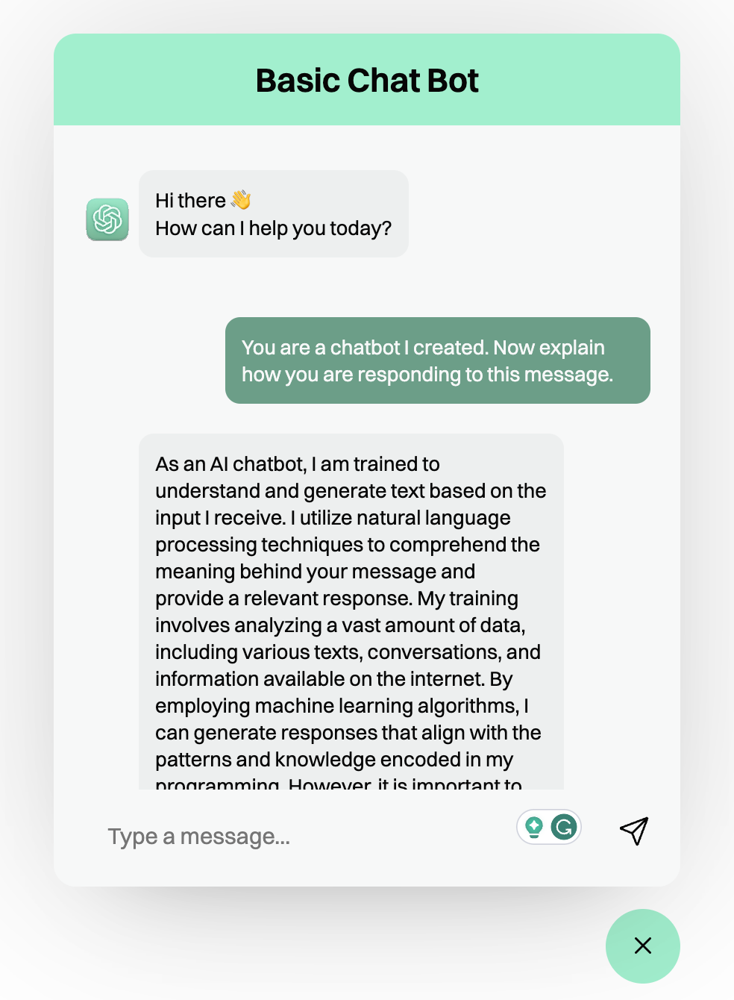

# Chat with GPT on local machine or web!




# How-To Guide:

## Clone Repo

Get started by cloning my repo in your terminal (preferably in VS Code) by running the git clone command `git clone https://github.com/mikestangdevs/EverythingLLM.git` then head to GPT/web-bot folder


## Input your OpenAI API Key

Inside the 'bot.js' file enter your OpenAI API key in 
```javascript 
const API_KEY = "OPENAI_API_KEY";
```


## Deploy

If your in VS Code, click the `Go Live` button on the bottom right of your screen and it will deploy a local web host where you can play with ChatGPT on your own machine.


## Bonus

Sign up for a `Vercel` account and deploy it live for your friends & family to try 

Read [Vercel's](https://github.com/vercel/vercel/tree/main) documentation here 